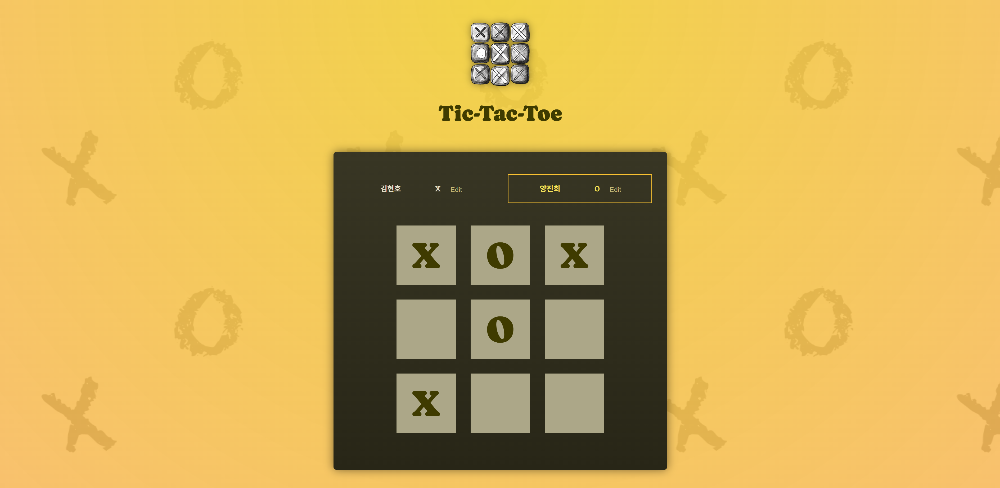
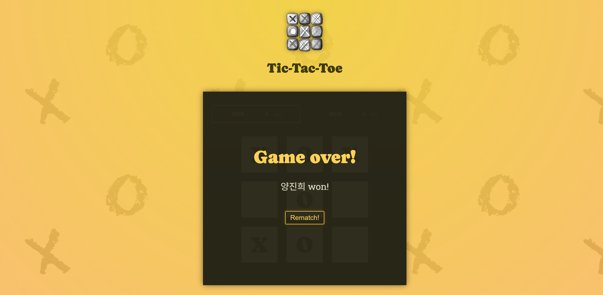

# 틱택토 게임 - React 학습 프로젝트

## 📸 게임 스크린샷




## 📖 프로젝트 소개

이 프로젝트는 React의 핵심 개념들을 학습하기 위해 구현한 틱택토 게임입니다. React의 기본적인 개념들부터 고급 패턴들까지 다양한 기술을 적용하여 구현했습니다.

## 🚀 주요 기능

- **플레이어 이름 편집**: 각 플레이어의 이름을 실시간으로 수정 가능
- **게임보드 상호작용**: 3x3 격자에서 X, O 선택
- **게임 로그**: 각 턴의 기록을 실시간으로 추적
- **승부 판정**: 8가지 승리 조건 자동 체크 (가로, 세로, 대각선)
- **무승부 판정**: 9턴 완료 시 무승부 처리
- **게임 재시작**: 새로운 게임을 위한 상태 초기화

## 📚 학습한 React 개념들

### 1. **컴포넌트 설계 및 분리**

```jsx
// 기능별로 컴포넌트를 분리하여 재사용성과 유지보수성 향상
-App.jsx - // 메인 애플리케이션 로직
  Player.jsx - // 플레이어 정보 관리
  GameBoard.jsx - // 게임보드 렌더링
  Log.jsx - // 게임 기록 표시
  GameOver.jsx; // 게임 종료 화면
```

### 2. **useState 훅 활용**

- **플레이어 상태 관리**: 플레이어 이름과 편집 상태
- **게임 턴 관리**: 모든 게임 턴을 배열로 관리
- **입력 상태 관리**: 실시간 입력값 처리

### 3. **상태 끌어올리기 (Lifting State Up)**

```jsx
// 여러 컴포넌트에서 공유하는 상태를 상위 컴포넌트로 이동
const [gameTurns, setGameTurns] = useState([]);
const [players, setPlayers] = useState(PLAYERS);
```

### 4. **파생 상태 (Derived State)**

```jsx
// 기존 상태로부터 새로운 값을 계산하여 불필요한 상태 제거
const activePlayer = deriveActivePlayer(gameTurns);
const gameBoard = deriveGameBoard(gameTurns);
const winner = deriveWinner(gameBoard, players);
```

### 5. **Props를 통한 데이터 전달**

- **하향 데이터 플로우**: 부모에서 자식으로 데이터 전달
- **함수 전달**: 이벤트 핸들러를 props로 전달하여 상향 통신

### 6. **조건부 렌더링**

```jsx
// JSX에서 조건에 따른 컴포넌트 렌더링
{
  (winner || hasDraw) && <GameOver winner={winner} onRestart={handleRestart} />;
}
```

### 7. **배열 메서드 활용**

```jsx
// map()을 사용한 동적 리스트 렌더링
{
  board.map((row, rowIndex) => (
    <li key={rowIndex}>
      {row.map((playerSymbol, colIndex) => (
        <button key={colIndex}>{playerSymbol}</button>
      ))}
    </li>
  ));
}
```

### 8. **이벤트 핸들링**

- **클릭 이벤트**: 게임보드 셀 선택, 플레이어 이름 편집
- **입력 이벤트**: 실시간 텍스트 입력 처리
- **폼 제출**: 플레이어 이름 저장

### 9. **불변성 유지**

```jsx
// 상태 업데이트 시 기존 객체/배열을 변경하지 않고 새로운 객체 생성
setGameTurns((prevTurns) => {
  const updatedTurns = [
    { square: { row: rowIndex, col: colIndex }, player: activePlayer },
    ...prevTurns,
  ];
  return updatedTurns;
});
```

### 10. **함수형 프로그래밍 패턴**

- **순수 함수**: 파생 상태 계산 함수들
- **고차 함수**: 이벤트 핸들러 내부의 함수형 접근

## 📁 프로젝트 구조

```
src/
├── App.jsx                 # 메인 애플리케이션 컴포넌트
├── index.jsx              # React 앱 진입점
├── index.css              # 전역 스타일
├── winning-combinations.js # 승리 조건 정의
└── components/
    ├── Player.jsx         # 플레이어 컴포넌트
    ├── GameBoard.jsx      # 게임보드 컴포넌트
    ├── Log.jsx           # 게임 로그 컴포넌트
    └── GameOver.jsx      # 게임 종료 컴포넌트
```

## 🛠 기술 스택

- **React**: 19.0.0
- **Vite**: 개발 환경 및 빌드 도구
- **JavaScript ES6+**: 모던 자바스크립트 문법
- **CSS3**: 스타일링

## 🎯 실행 방법

1. **의존성 설치**

   ```bash
   npm install
   ```

2. **개발 서버 실행**

   ```bash
   npm run dev
   ```

3. **프로덕션 빌드**
   ```bash
   npm run build
   ```

## 🧠 핵심 학습 포인트

1. **컴포넌트 기반 아키텍처**: 기능별로 컴포넌트를 분리하여 코드의 재사용성과 유지보수성 향상
2. **상태 관리**: useState를 활용한 효과적인 상태 관리와 상태 끌어올리기 패턴
3. **데이터 플로우**: Props를 통한 단방향 데이터 흐름 이해
4. **파생 상태**: 기존 상태로부터 새로운 값을 계산하여 불필요한 상태 최소화
5. **불변성**: React에서 상태 업데이트 시 불변성 유지의 중요성
6. **이벤트 처리**: 사용자 상호작용을 위한 다양한 이벤트 핸들링 방법

이 프로젝트를 통해 React의 핵심 개념들을 실제 애플리케이션에 적용하는 방법을 배웠습니다.
